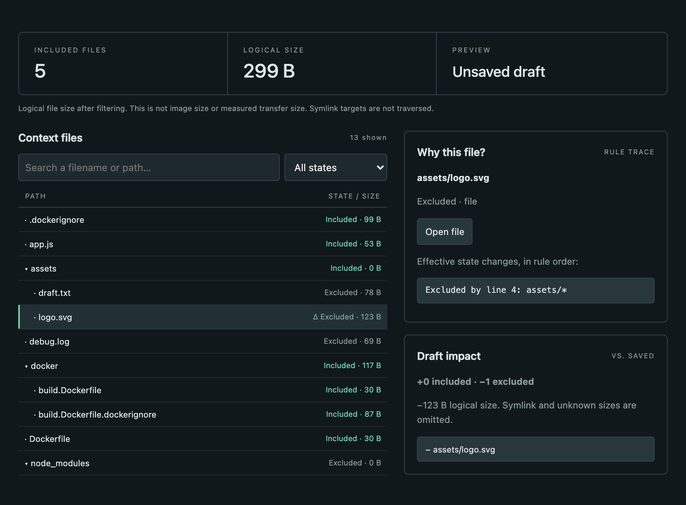

# Dockerignore Inspector

See which files your Docker build context includes, why their state changes, and what happens as you edit `.dockerignore`.

**Supported platforms: Apple Silicon macOS (`darwin-arm64`) and glibc Linux x64 (`linux-x64`), VS Code Desktop 1.137.0+. Trusted local workspaces only.** Windows is still being validated and is not enabled; no release date is promised. WSL, Remote SSH, Dev Containers, and VS Code Web are unsupported. Sizes are logical file sizes, not transfer or image sizes.

A local VS Code Desktop extension for debugging ignore rules. No Docker daemon, account, Go installation, network connection, or API key is needed to inspect a directory.



*Detail view rendered from the extension’s webview and bundled example at 2× resolution. Removing `!` from `!assets/logo.svg` excludes the logo; the rule trace explains why.*

[Watch the saved → draft → undo capture in VS Code](docs/images/draft-preview.gif).

## Install

[Install from Visual Studio Marketplace](https://marketplace.visualstudio.com/items?itemName=achenachen.dockerignore-inspector).

1. Open the listing in **VS Code 1.137.0 or later** and choose **Install** for the regular release channel.
2. Run **Dockerignore: Open Example**.
3. Remove `!` from `!assets/logo.svg` without saving, inspect the change, then undo.

Publisher: `achenachen`. If you installed the earlier `local-preview` package, uninstall it to avoid duplicate commands.

### Alternative: install a VSIX

Download the package matching your platform, then run **Extensions: Install from VSIX…** and select it. Reload if prompted.

| Platform | Package |
| --- | --- |
| macOS, Apple Silicon | [darwin-arm64 VSIX](https://github.com/achenachena/dockerignore-inspector/releases/download/v0.2.0/dockerignore-inspector-0.2.0-darwin-arm64.vsix) |
| Linux, x64 (glibc) | [linux-x64 VSIX](https://github.com/achenachena/dockerignore-inspector/releases/download/v0.2.0/dockerignore-inspector-0.2.0-linux-x64.vsix) |

[Release notes and SHA-256 checksums](https://github.com/achenachena/dockerignore-inspector/releases/tag/v0.2.0).

## Try it in three steps

1. Run **Dockerignore: Inspect Build Context**, click **Select context**, then select the context directory and the Dockerfile you actually build with. These are separate choices. You can also right-click a Dockerfile and select the command; that file is retained while you choose the build context.
2. Select a file in the tree. Follow the effective rule changes and click a rule to jump to its line.
3. Edit the active ignore file without saving. The **Draft impact** panel compares the draft with the saved rules. Undo to restore the previous result.

**Open example** copies a tiny fixture into a temporary directory and opens its rules. Remove the `!` from `!assets/logo.svg` without saving: the logo becomes excluded. Use **Select Dockerfile** to choose `docker/build.Dockerfile` in that example and see its dedicated ignore file take precedence.

Search by relative path, filter included/excluded/changed entries, and refresh after filesystem changes. Double-click a directory to collapse it. Use Up/Down to select and Left/Right to collapse/expand. Changed-file lists have pagination.

## What the numbers mean

The tree shows rule-based context inclusion and logical sizes of regular files. Directory sizes sum included descendant files once. This is **not image size, actual BuildKit transfer size, or measured build-time savings**. Build stages, COPY commands, caches, and incremental transfer affect those separately.

Dockerfile-specific ignore files replace root rules, including when the dedicated file is empty. Ignored Dockerfiles and active ignore files can still be read by Docker as build inputs; that does not make them available to ordinary COPY operations.

The trace lists effective state transitions in rule order. A later redundant rule that leaves the state unchanged is not shown as a new cause. Matching uses pinned Moby patternmatcher, with a WASM worker bundled in the extension.

## Support and limits

- Local trusted VS Code Desktop workspaces on Apple Silicon macOS and glibc Linux x64. Intel macOS, Linux ARM, and Alpine are not validated or packaged. See [validation](docs/VALIDATION.md) for actual tested platforms; Windows, Web, remote SSH, WSL, and Dev Containers are blocked in this preview.
- One selected context and Dockerfile at a time. No Compose/Bake parsing, remote Git contexts, named contexts, or Dockerfile execution.
- Symlinks are listed but not followed or included in logical byte totals. Target COPY behavior is not simulated. Special filesystem entries are unknown.
- Manual refresh discovers file changes. Active ignore edits update automatically inside the workspace; use Refresh for external-context changes.
- The default scan limit is 100,000 entries. Configure `dockerignore.maxEntries` to change it. Partial results are labeled, and unreadable entries are unknown.
- Invalid rules disable totals and draft comparison. A cancelled operation leaves explicitly stale previous results until refreshed.
- The extension reads filesystem metadata and necessary rule text only. It never executes project code or automatically modifies rules.

## Privacy and feedback

No telemetry, uploads, accounts, or runtime network requests. See [PRIVACY.md](PRIVACY.md).

When reporting a problem, provide a minimal public fixture, expected behavior, actual behavior, and VS Code/OS versions. Remove private paths, credentials, and proprietary source. Do not upload an entire private project.

## Development

Requires Node.js 22+, Go 1.24+, and VS Code Desktop. Docker is needed only for compatibility tests.

```sh
npm ci
npm run build
npm run lint
npm run typecheck
npm test
npm run test:engine
npm run test:docker
npm run package
npm run test:integration
```

See [development](docs/DEVELOPMENT.md), [validation](docs/VALIDATION.md), and [release preparation](docs/RELEASING.md). This is an independent community tool, not an official Docker product.
